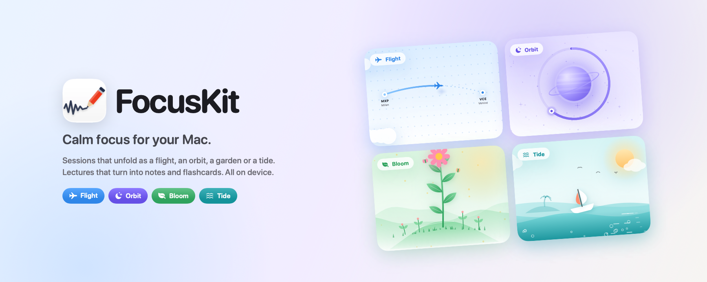

<p align="center">
  
</p>

<p align="center">
  <a href="https://github.com/Darkyyto/studykit/releases/latest/download/FocusKit.dmg"><b>Download for Mac</b></a>
  &nbsp;·&nbsp;
  <a href="https://github.com/Darkyyto/studykit/releases">Releases</a>
  &nbsp;·&nbsp;
  macOS 26 or later
</p>

# FocusKit

A calm workspace for your Mac. Say what you are working on, pick a mode, and watch the session unfold while you focus. Lectures and meetings are recorded, transcribed and turned into notes, all on device.

FocusKit adapts to who you are. Students get subjects, exam countdowns and lectures that turn into flashcards. Professionals get projects, deadlines and meeting minutes with action items. You can switch profile at any time.

## Installing

One line in Terminal downloads the latest version, installs it in Applications and opens it:

```sh
curl -fsSL https://raw.githubusercontent.com/Darkyyto/studykit/main/Scripts/install.sh | sh
```

Prefer the disk image? Download `FocusKit.dmg` from the [releases page](../../releases) and drag FocusKit into Applications. FocusKit is not notarized by Apple, so the first time macOS asks you to confirm it in **System Settings › Privacy & Security › Open Anyway**.

After that, updates install themselves. When a new version is out, FocusKit shows it at the bottom of the window: press **Update**, then **Restart and Update**. Your session is saved, the app is replaced and it opens again where you left it. A backup of your library is made before every update.

## Modes

- **Flight** – your session becomes a flight along a real route, followed on a calm map or satellite view, with clouds passing under the plane.
- **Orbit** – a satellite traces one long loop around a planet, with its moon, a nebula and the odd shooting star.
- **Bloom** – a seed grows leaf by leaf on a quiet hill and flowers when you finish.
- **Tide** – the water rises around a small boat as the session goes on.

Sessions can have several rounds with breaks in between. Breaks switch to a guided breathing scene, or to a few flashcards when you are studying.

## Sections

- **Focus** – what you are working on, the mode, the duration and, under Customize, the session type, rounds, subject, a PDF to read and a task list.
- **Subjects** (or Projects, or Goals) – weekly targets and exam or deadline countdowns. Open a subject to see everything in it: its lectures, PDFs, flashcards and recent sessions, and add more.
- **Lectures** (or Meetings) – every recording, grouped by day, with search and subject filters. Rename, move, merge, export as PDF or delete, one at a time or several at once with **Select**.
- **Journal** – streaks, a weekly chart, a 20 week heatmap and every past session with its notes.

## Recording

Lecture and Meeting sessions record while you focus. The live transcript appears beside your own notes. Drag the edge of the panel to make it wider, or expand it to the whole window with ⇧⌘\\ to read along in larger type.

- Quiet or distant voices are boosted and low hum is filtered out, so a professor across the room is still heard.
- The transcript is saved every few seconds and the audio survives a crash. An interrupted recording is recovered the next time FocusKit opens.
- When the recording ends, the whole lecture is transcribed again with a more accurate model. Apple Intelligence then fixes misheard words from context and writes clean notes, a summary and flashcards, or minutes with decisions and action items.
- Recording keeps going while you use other sections and stops when the session ends. It can also be stopped from Lectures, the notch or the menu bar.
- Two parts of the same lecture can be merged into one, audio, transcript, notes and flashcards included.

## Notch

On Macs with a notch, FocusKit lives in it and grows out of it. While a session runs or music plays, the time left and the song appear on either side of the camera, and a new song, a break or a finished session slides in beside it without covering the screen. Move the pointer to the top of the screen and it opens:

- **Home** – how long you have focused today and a Start button: pick a mode and a duration and the session begins, right from the notch. During a session it shows the time left with its controls, next to the song playing or the time and your next event.
- **Music** – the cover, the song, a bar you can drag to move through it and the controls. It works with Spotify, Music and any app that shows in Control Center's Now Playing, such as Safari, Chrome, Podcasts or VLC.
- **Calendar** – today in large type, the day's events (or tomorrow's when today is clear) and a small month to pick another day.
- **Tray** – drag files onto the notch to keep them close. Drag them back out wherever you need them, or AirDrop and share them.
- **Clipboard** – the last 40 things you copied, ready to copy again with a click. It is off until you turn it on, never keeps passwords and is cleared when FocusKit quits.

Volume, brightness and charging show up in the notch too, as a slim bar on either side of the camera, along with AirPods connecting, Do Not Disturb and other Focus modes, Caps Lock, low battery and unlocking your Mac. A light tap on the trackpad tells you when the notch opens. Turn on **Replace the macOS indicators** in Settings › Notch and FocusKit handles the volume and brightness keys itself, so only the notch appears. This needs the Accessibility permission, asked once.

At rest the notch matches your Mac's own, so nothing shows until something happens. Right-click it to open FocusKit or its Settings. Choose when it appears, line it up with your Mac's notch and pick which notices to see in **Settings › Notch**.

## Lock screen

When your Mac is locked, FocusKit shows a small lock beside the camera and can show a friendly greeting, your session, battery, headphones, your next event and the song playing below the clock. The widgets never take clicks and disappear the moment you unlock. Choose them, and a Glass or Clear look, in **Settings › Lock Screen**.

## Appearance

FocusKit follows your Mac's light or dark appearance. To keep it always light or always dark, choose in **Settings › Profile**.

## Menu bar

FocusKit keeps a small icon in the menu bar with a short menu: open FocusKit, Settings, check for updates or quit. Hide it in **Settings › Focus** if you prefer.

Closing the window does not quit the app. FocusKit leaves the Dock and keeps running in the menu bar and the notch, ready for the next session. Turn this off in **Settings › Focus**.

## Keyboard shortcuts

| Action | Shortcut |
| --- | --- |
| Switch section | ⌘1 – ⌘4 |
| Start session | ⌘↩ (hold ⌥ to skip the check-in) |
| Pause / resume | Space or ⇧⌘P |
| Skip round or break | ⇧⌘K |
| End session | ⌘. |
| New subject | ⌘N |
| Export lecture as PDF | ⇧⌘E |

## Privacy

There is no account, no analytics and no server. Nothing about you, your sessions or your recordings ever leaves this Mac. Your library, recordings and settings are stored locally, and speech recognition, notes and flashcards run on device.

FocusKit goes online for three things only:

- map imagery for Flight, which Apple Maps provides;
- the cover of the song playing in Spotify, downloaded from Spotify's image server like Spotify itself does;
- checking GitHub for a new version, which you can turn off in Settings › Updates.

What the notch and the lock screen show, such as the song playing, your calendar, your battery and your headphones, is read on this Mac only to display it to you, and is never stored or sent anywhere. Clipboard history, if you turn it on, stays in memory, never keeps passwords and is cleared when FocusKit quits.

Recordings are your responsibility: record lectures and meetings only where you are allowed to, and ask first when in doubt.

## Building

Requires macOS 26, Xcode 26 and [XcodeGen](https://github.com/yonaskolb/XcodeGen).

```sh
make run
```

| Command | What it does |
| --- | --- |
| `make run` | Builds a debug copy and opens it |
| `make dmg` | Builds a universal release in `dist/` |

Pushing a tag such as `v0.4.0` builds the disk image on GitHub Actions and publishes the release that the app offers as an update.

## License

FocusKit is free to use for personal, study and other noncommercial purposes under the [PolyForm Strict License 1.0.0](LICENSE). The source is published so you can see how it works and what it does with your data. Modifying it, redistributing it or publishing derived apps is not permitted.

Versions up to 0.3.0 were released under the MIT License.
